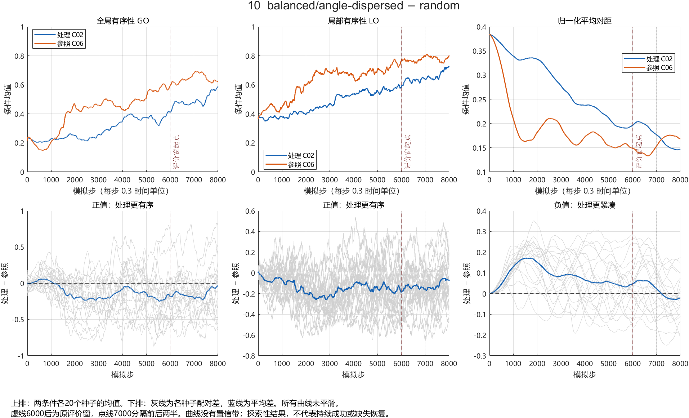

# 科学问题一：C 部分分析与图表

本目录发布截至 2026-09-29 的数据审查、条件与种子台账、配对分析、图表及复现材料。工作/发布分支为 **YCwork**。

**新增交接：[B：四分支缺失实验实施与数据交付入口](B_HANDOFF.md)。** 协议1.2、560条运行计划、80条T=0计划及A成果复核已随本次发布提供；实验尚未运行，先完成B实现和C验收。

**当前证据：12 个规范条件 × 20 个已使用 seed，属于探索性分析。** 原始 480 个标签对应 240 个规范运行，重复标签不增加独立样本量。没有观测缺失实验，不支持预测收益、最优邻居数或安全保证。

## 推荐阅读顺序

1. [时序分析简明结论与读图说明](sq1-c-time-analysis-v1/README.md)
2. [11 组时序图与窗口统计](sq1-c-time-analysis-v1/REPORT.md)
3. [三组汇总图说明](sq1-c-visualization-v1/README.md)
4. [240 行规范数据的配对分析](sq1-c-paired-analysis-v1/PAIRED_ANALYSIS.md)
5. [WHQ 最新交付核查与后续 C/B 分工](sq1-whq-update-0036487/WHQ更新核查与C工作计划.md)
6. [240 个运行到 MAT 的分析入口](sq1-c-raw-index-v1/README.md)
7. [条件映射与种子台账](sq1-c-condition-ledger-v1/README.md)

### 图表示例：分散选邻相对随机选邻



蓝色为分散/balanced（C02），橙色为随机（C06），均为 k=8、固定总幅值。上排是条件均值，下排灰线是20个seed各自的配对差，蓝线是平均差。下排 GO/LO 正值更有序，对距负值更紧凑。没有置信带，不以视觉分离宣布逐时刻显著。

所有图均有同名 SVG。共 14 张 PNG、14 张 SVG。

## 版本与旧文档状态

- B 初始交付：`63d56b51cb74bca509b0fb7dc29d1d5997d3a1ae`。
- B 正式 raw 补交：`0036487818d891c23d357f7af49030f323f4c9af`。
- 新旧汇总 CSV 完全相同；480 份正式 MAT 的指标、轨迹和重复标签等价性已核查。
- 早期审查中“正式 raw 缺失”已由新交付解决；以最新核查文档为准，不重复要求 B 补交。本目录保留早期文件作为历史记录。
- 各报告中的“未提交”“本地 HEAD=71583f9”等是生成时状态，本次集中发布后不再代表当前 Git 状态；内容与来源哈希保持不变。
- 当前任务：C已提供四分支缺失协议1.2和交付清单；B补接口与契约测试，A核对输入定义。正式运行仍待实现验收，尚未完成独立验证。

## 原始数据恢复与复现

浏览报告和图表无需下载原始数据。为避免重复上传约 270 MB ZIP 及解包 MAT，源快照在本目录被忽略，但保留固定提交、文件清单、压缩包内路径和 SHA256。

要执行依赖 MAT 的分析，先在仓库根目录运行：

```text
git fetch origin refs/heads/WHQ_work:refs/remotes/origin/WHQ_work
python reviews/restore_sources.py
```

恢复脚本需 Python 3.9+，只使用标准库；按清单恢复两版快照与 480 份正式 MAT，对已有文件逐字节核对，不覆盖不同内容。所需 Git 对象来自上面的固定提交，若远端分支未来不再包含该历史，需获取相应固定提交或原归档。

随后按各目录说明执行 MATLAB 或 Python 脚本。多数新脚本拒绝覆盖已发布输出，完整重跑应放到新的同级目录；旧分析脚本可能覆盖同目录输出，也应复制到新目录后运行。原实验生成于 MATLAB R2023a，本轮读取/绘图验证使用 R2024b。无需重新运行仿真即可重建分析。

## 验证、限制与回退

已完成正式数据均值复算、38,400帧周期边界距离独立复算、240次额外标签等价核查、原配对结果复现、窗口独立复算及所有图面检查。失败的早期检查日志也保留，不能将其误读为最终检查仍失败。

bootstrap 单位为 seed，20,000 次，计算种子20260929；区间逐项未校正多重比较。时间点不是独立重复，时序差异不是纯方位因果效应。发布不改变证据等级。

仅新增分析材料和最初的三人研究计划，不改 main、原始仿真器或历史实验。建议作为探索性协作材料使用，不自动合并 main。若需撤回共享发布，用 git revert 对应发布提交，不删除原始结果或重写历史。
