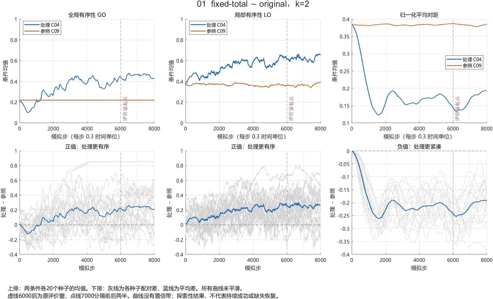
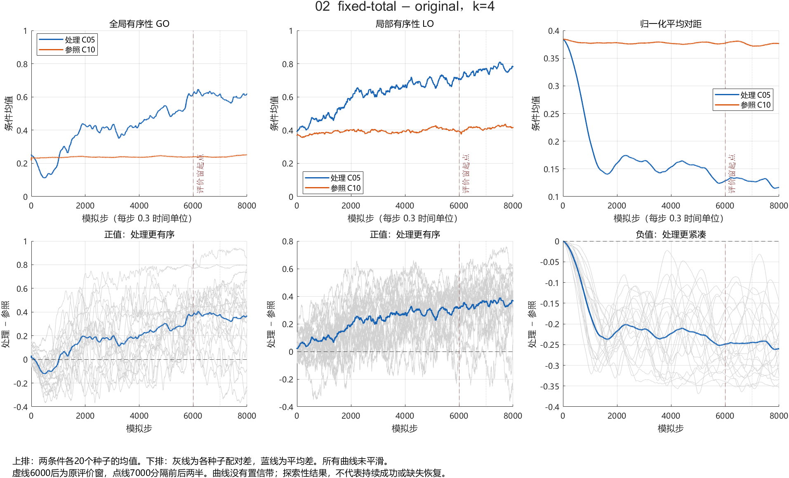
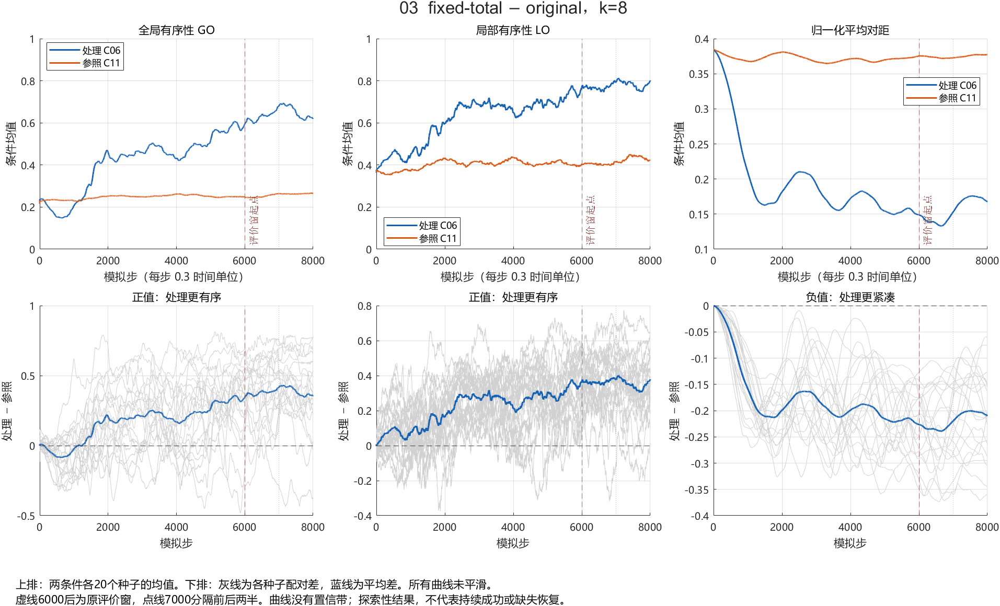
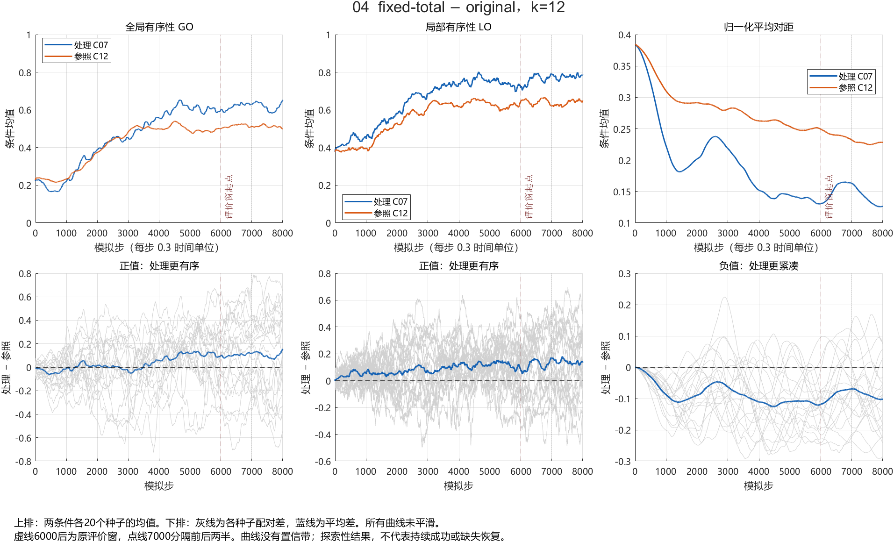
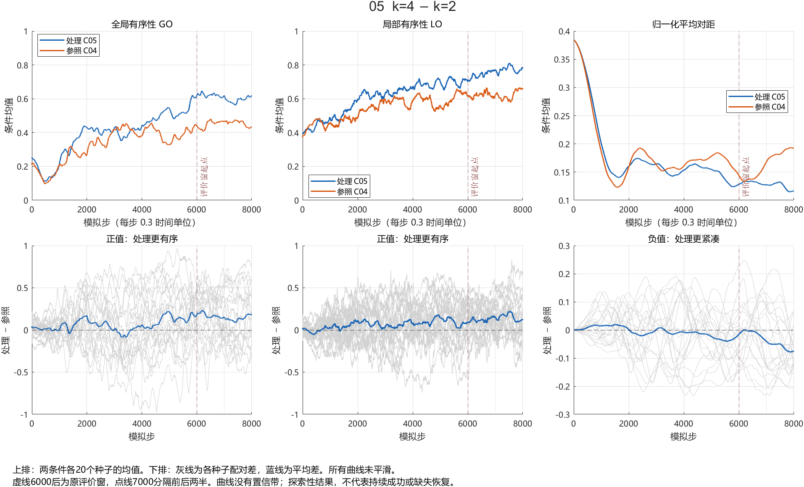
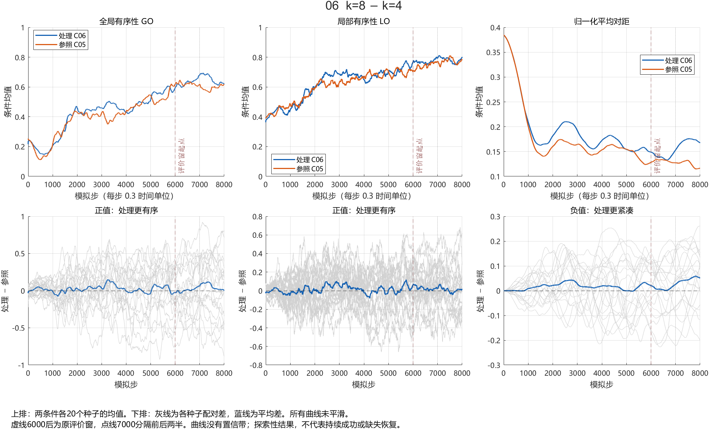
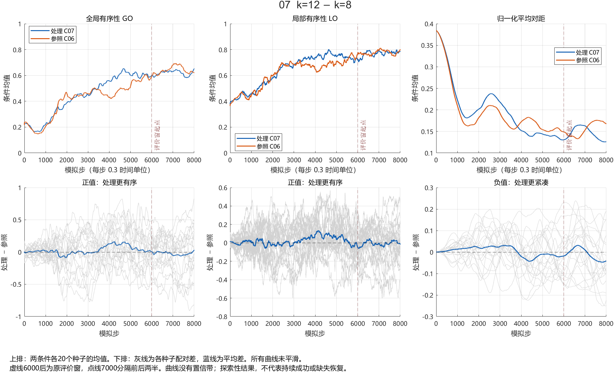
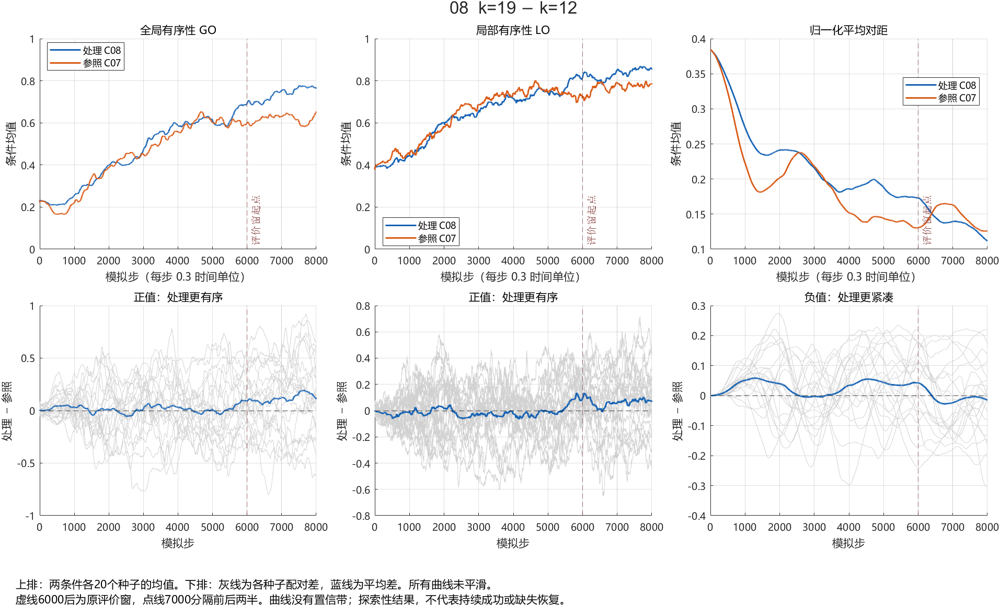
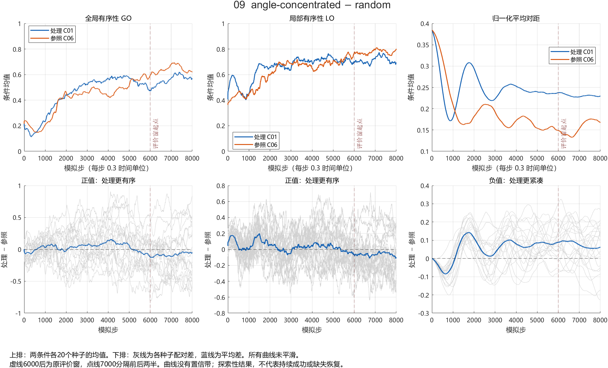
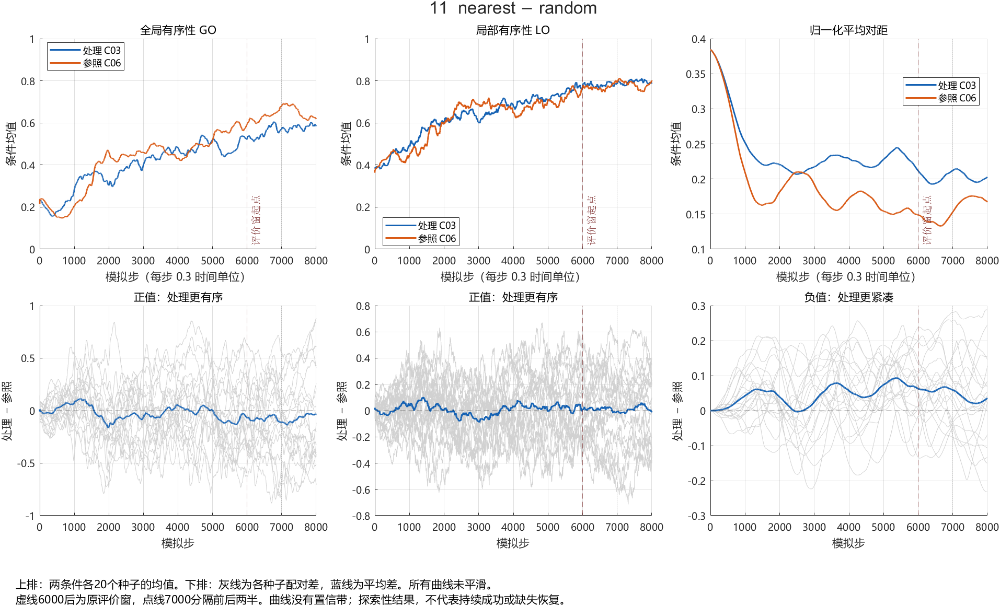

# 时间过程与窗口配对分析

来源 WHQ_work@0036487；240规范运行、12条件、每条件20个已使用seed。探索性分析，不新增仿真。

## 如何读图

每张图上排是处理条件（蓝）和参照条件（橙）的20种子平均曲线；下排灰线是各seed的配对差，蓝线是平均差。上排均值不表示每条轨迹均如此。下排GO/LO正值表示处理更有序，对距负值表示更紧凑。

横轴为模拟步，乘0.3得到模型时间。6000步后是原评价窗，7000步把它分成等长两半。所有8000点均绘出，未平滑；未绘置信带，不能据曲线某一点宣布显著或持续成功。

## 方法与核查

沿用原11组对比。主窗口6001–8000，前半6001–7000，后半7001–8000；另计算后半配对差减前半配对差，以描述效应是否随窗口变化。不是恢复时间、稳态检验或时间趋势的因果估计。

按完整seed共用索引重采样20,000次，计算种子20260929，仅用于计算。线性插值百分位95%区间逐项未校正；132项结果与既有数据均为探索性。不从时间点数推导样本量。

主窗均值与旧CSV以及旧配对bootstrap结果一致，旧配对均值/区间最大差0；主窗等于两半平均的最大误差2.55e-15。240个MAT哈希全部通过。

时间点自相关，图中均值可能掩盖种子差异；方位策略还混合邻居身份、距离辅助和动态网络。这里未验证跨策略共同随机驱动，不能据此分离纯方位因果效应。

## 1. fixed-total − original，k=2

|指标|前半平均差|后半平均差|后半−前半 [逐项95%区间]|
|---|---:|---:|---|
|meanGO|+0.22914|+0.23598|+0.00684 [-0.05609, +0.07872]|
|meanLO|+0.26113|+0.25358|-0.00756 [-0.07694, +0.06416]|
|meanPairDistanceNorm|-0.24124|-0.19718|+0.04406 [+0.02140, +0.06827]|

## 2. fixed-total − original，k=4

|指标|前半平均差|后半平均差|后半−前半 [逐项95%区间]|
|---|---:|---:|---|
|meanGO|+0.38239|+0.34841|-0.03398 [-0.11434, +0.04281]|
|meanLO|+0.33546|+0.35368|+0.01823 [-0.01516, +0.05325]|
|meanPairDistanceNorm|-0.24675|-0.24929|-0.00254 [-0.03094, +0.02605]|

## 3. fixed-total − original，k=8

|指标|前半平均差|后半平均差|后半−前半 [逐项95%区间]|
|---|---:|---:|---|
|meanGO|+0.37817|+0.39011|+0.01194 [-0.04499, +0.07521]|
|meanLO|+0.36512|+0.35081|-0.01431 [-0.04926, +0.01871]|
|meanPairDistanceNorm|-0.23288|-0.20521|+0.02768 [+0.00018, +0.05515]|

## 4. fixed-total − original，k=12

|指标|前半平均差|后半平均差|后半−前半 [逐项95%区间]|
|---|---:|---:|---|
|meanGO|+0.10326|+0.10487|+0.00162 [-0.08543, +0.08685]|
|meanLO|+0.11567|+0.14076|+0.02509 [-0.03082, +0.08006]|
|meanPairDistanceNorm|-0.08748|-0.08748|+0.00000 [-0.03038, +0.03082]|

## 5. k=4 − k=2

|指标|前半平均差|后半平均差|后半−前半 [逐项95%区间]|
|---|---:|---:|---|
|meanGO|+0.17202|+0.13652|-0.03549 [-0.15403, +0.07950]|
|meanLO|+0.12094|+0.15139|+0.03045 [-0.02952, +0.09015]|
|meanPairDistanceNorm|-0.01179|-0.05898|-0.04718 [-0.08240, -0.01294]|

## 6. k=8 − k=4

|指标|前半平均差|后半平均差|后半−前半 [逐项95%区间]|
|---|---:|---:|---|
|meanGO|+0.00842|+0.06087|+0.05244 [-0.04870, +0.17248]|
|meanLO|+0.02725|+0.00911|-0.01814 [-0.07654, +0.03894]|
|meanPairDistanceNorm|+0.00933|+0.04547|+0.03614 [-0.00304, +0.07589]|

## 7. k=12 − k=8

|指标|前半平均差|后半平均差|后半−前半 [逐项95%区间]|
|---|---:|---:|---|
|meanGO|-0.01084|-0.03624|-0.02540 [-0.11550, +0.05828]|
|meanLO|-0.00940|-0.00485|+0.00456 [-0.04795, +0.05216]|
|meanPairDistanceNorm|+0.01216|-0.03051|-0.04267 [-0.07992, -0.00574]|

## 8. k=19 − k=12

|指标|前半平均差|后半平均差|后半−前半 [逐项95%区间]|
|---|---:|---:|---|
|meanGO|+0.09412|+0.14341|+0.04929 [-0.03970, +0.14611]|
|meanLO|+0.05592|+0.07295|+0.01703 [-0.04355, +0.07965]|
|meanPairDistanceNorm|-0.00310|-0.00987|-0.00677 [-0.03645, +0.02266]|

## 9. angle-concentrated − random

|指标|前半平均差|后半平均差|后半−前半 [逐项95%区间]|
|---|---:|---:|---|
|meanGO|-0.10079|-0.06542|+0.03536 [-0.07064, +0.13451]|
|meanLO|-0.06998|-0.05520|+0.01478 [-0.04678, +0.07870]|
|meanPairDistanceNorm|+0.09127|+0.05968|-0.03160 [-0.06659, +0.00258]|

## 10. balanced/angle-dispersed − random

|指标|前半平均差|后半平均差|后半−前半 [逐项95%区间]|
|---|---:|---:|---|
|meanGO|-0.16184|-0.13809|+0.02375 [-0.06246, +0.11401]|
|meanLO|-0.14057|-0.11325|+0.02732 [-0.03258, +0.08739]|
|meanPairDistanceNorm|+0.05392|-0.01446|-0.06838 [-0.10440, -0.03459]|

## 11. nearest − random

|指标|前半平均差|后半平均差|后半−前半 [逐项95%区间]|
|---|---:|---:|---|
|meanGO|-0.07641|-0.07455|+0.00186 [-0.10061, +0.10048]|
|meanLO|+0.01144|+0.01237|+0.00093 [-0.05079, +0.04949]|
|meanPairDistanceNorm|+0.06056|+0.03301|-0.02755 [-0.05971, +0.00498]|

## 文件与边界

- `run_windows.csv`：2160行，各运行/指标/窗口的均值、时间标准差和极差。
- `paired_windows.csv`：1980行，逐seed窗口配对值。
- `window_effects.csv`：132项配对均值、区间、方向计数；方向计数不是成功率。
- 11张PNG及同名SVG；DESIGN.md为本轮固定方案，审计JSON和MATLAB日志记录验证。

当前数据没有观测缺失，不能据此证明缺失恢复、预测收益或安全；仍需B完成四分支接口及测试，C冻结缺失协议。

工作分支YCwork@71583f9，新增内容仅在本目录，未提交或推送。原始代码、历史数据、此前分析和main未改动。建议保留为探索性材料；不作为确认性结论直接合并main。回退仅涉及本新增目录，共享提交后使用git revert。
